<div align="center">

# NeoKeys

Register keyboard shortcuts once, get a help overlay free

[![Live][badge-site]][url-site]
[![HTML5][badge-html]][url-html]
[![CSS3][badge-css]][url-css]
[![JavaScript][badge-js]][url-js]
[![Claude Code][badge-claude]][url-claude]
[![License][badge-license]](LICENSE)

[badge-site]:    https://img.shields.io/badge/live_site-0063e5?style=for-the-badge&logo=googlechrome&logoColor=white
[badge-html]:    https://img.shields.io/badge/HTML5-E34F26?style=for-the-badge&logo=html5&logoColor=white
[badge-css]:     https://img.shields.io/badge/CSS3-1572B6?style=for-the-badge&logo=css3&logoColor=white
[badge-js]:      https://img.shields.io/badge/JavaScript-F7DF1E?style=for-the-badge&logo=javascript&logoColor=black
[badge-claude]:  https://img.shields.io/badge/Claude_Code-CC785C?style=for-the-badge&logo=anthropic&logoColor=white
[badge-license]: https://img.shields.io/badge/license-MIT-404040?style=for-the-badge

[url-site]:   https://neokeys.neorgon.com/
[url-html]:   #
[url-css]:    #
[url-js]:     #
[url-claude]: https://claude.ai/code

</div>

---

## Overview

NeoKeys is the keyboard shortcut registry for the Neorgon fleet, and this site is both its
documentation and its reference implementation. Declare a shortcut as data and you get three
things that a hand-written `if (e.key === 'x')` cannot give you: a help sheet that generates
itself, a collision check that refuses a reserved key out loud, and a remap panel that makes
single-character shortcuts meet WCAG 2.1 SC 2.1.4.

Every key described here is live on the page. So is the typing guard, which you can watch hold
by clicking into a text field and pressing one.

**Live:** neokeys.neorgon.com

---

## Features

- **The `?` sheet** -- lists whatever is registered, generated on open, so it cannot disagree with the bindings
- **Collision detection** -- reserved keys are refused with a reason, taken keys are refused, fleet conventions warn
- **The typing guard** -- shortcuts never fire in an input, textarea, select, or contenteditable
- **`H` chrome toggle** -- hides the header and footer and returns about 105px, opt-in per site
- **`G` fleet switcher** -- fuzzy jump across all 51 live Neorgon sites, read from the shared registry
- **Remap and disable** -- rebind any key or switch single-key shortcuts off entirely, stored per site
- **`M` storefront** -- a joke about microtransactions, behind its own meta tag so it only appears where it lands

---

## Running locally

ES modules require an HTTP server (not `file://`):

```bash
make serve
```

Then open http://localhost:8865.

---

## Using NeoKeys on another site

Copy `js/neokeys/` in, link its stylesheet, and start it:

```html
<link rel="stylesheet" href="js/neokeys/keys.css">
```

```js
import { init } from './js/neokeys/index.js';
init();

NeoKeys.register([
  { key: 'c', label: 'Console',   run: goConsole },
  { key: 't', label: 'Transform', run: cycleForm },
]);
```

Opt in to the extras with meta tags, because neither belongs on every site:

```html
<meta name="neo-chrome-toggle" content="on">
<meta name="neo-keys-store" content="on">
```

`H` is only right where the header is chrome rather than navigation. On a reading site the bar
carries the way between guides, and hiding navigation is a bug, not a feature.

---

## The key map

| Tier | Keys | Rule |
|---|---|---|
| Fleet reserved | `?` `H` `G` | The kit binds them. Registering one is refused |
| Fleet convention | `/` `Esc` `S` `E` `R` `[` `]` | The kit does not implement them, but the meaning is fixed |
| Site owned | everything else | Register it and it appears in the sheet |

`Escape` is deliberately a convention rather than a reservation. Nearly every site already binds
it to close its own layers, so a kit that claimed it would either break them or become a rule
nobody keeps.

---

## Rolling it out without breaking text entry

A bare `h` landing in a text field is the one failure that gets the whole system switched off,
so the guard is layered and the rollout is gated.

**The guard** resolves the event through `composedPath()`, which matters: `e.target` is
retargeted at a shadow boundary, so an `<input>` inside a shadow root reports the host element
and a naive guard fires straight into a live field. It also treats `role="textbox"`,
`searchbox`, `combobox` and `spinbutton` as text, and refuses to act while an input method
editor is composing. All three of those were confirmed holes before they were fixed, not
hypotheticals.

**Two escape hatches** for surfaces the kit cannot recognise:

```html
<div data-neo-keys="off"> ... any custom editor ... </div>
```

```js
init({ typingSelector: '.cm-editor, .ProseMirror' });
```

**Preflight before enabling a site:**

```bash
python3 tools/preflight.py            # whole fleet
python3 tools/preflight.py my-site    # one project
```

It sorts every project into `safe`, `guarded`, or `review` by reading its source. Current
state of the fleet: **40 safe, 14 guarded, 7 review**. Every site in `review` already binds a
reserved key bare, including two the eye had missed: `slides-site` uses `g` for its grid view,
and `pathfinder-site` has grown its own bare-`h` chrome toggle. Both would have collided on
day one.

---

## Architecture



```
neokeys-site/
├── index.html              # Page shell, meta opt-ins, section scaffolding
├── css/
│   └── style.css           # Site styles, lime accent, page sections
├── data/
│   └── fleet.json          # Live site list for the G switcher (trimmed registry)
├── js/
│   ├── app.js              # Entry point, under 30 lines
│   ├── content.js          # Page copy and the survey data, as data
│   ├── state.js            # The little state the page owns
│   ├── render.js           # Builds every section from content.js
│   ├── events.js           # Demo wiring plus this page's own shortcuts
│   ├── tips.js             # Rotating loading-screen tips
│   ├── utils.js            # Small shared helpers
│   └── neokeys/            # THE KIT, written to lift into a packages/neorgon-ui kit
│       ├── index.js        # Assembly, window.NeoKeys, meta-tag opt-ins
│       ├── core.js         # Registry, typing guard, dispatch, prefs
│       ├── overlay.js      # The ? sheet and the remap panel
│       ├── chrome.js       # The H toggle and its cookie
│       ├── fleet.js        # The G switcher
│       ├── store.js        # The M joke
│       └── keys.css        # Kit styles, travels with the module
├── tools/
│   └── preflight.py        # Rollout gate: sorts sites into safe / guarded / review
└── docs/
    └── architecture.mmd    # Diagram source
```

`js/neokeys/` imports nothing from the site. That is the constraint that keeps it liftable, and
the reason this project can become `packages/neorgon-ui/keys/` by copying one directory.

---

<div align="center">

Part of [Neorgon](https://neorgon.com/)

</div>
